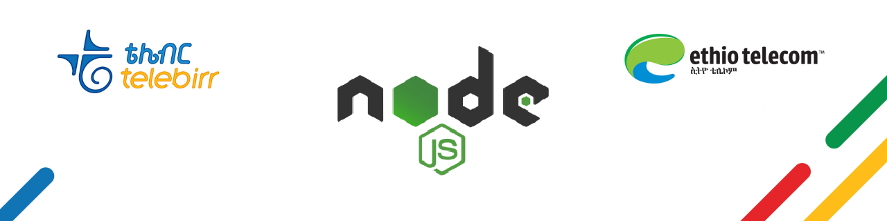

<a href="https://aimeos.org/">
    
</a>

# telebirrjs




telebirrjs is a Nodejs library for [telebirr](https://www.ethiotelecom.et/telebirr/).  
Telebirr is a mobile money service developed by Huawei that is owned and was launched by Ethio telecom.  
This library will help you by providing an easy integration method so you can focus on your main task

## Table of content
- [telebirrjs](#telebirrjs)
  - [Table of content](#table-of-content)
  - [Installation](#installation)
    - [Composer](#composer)
  - [Usage](#usage)
    - [Required information's](#required-informations)
    - [General setup](#general-setup)
    - [To initialize payment](#to-initialize-payment)
    - [Handling callback notifications](#handling-callback-notifications)

## Installation
### Composer
```
npm i telebirrjs
```

## Usage
### Required information's
you will receive the required information from Tele with information which looks like theis :arrow_down:

| merchant name   | short code   |  APP ID | APP KEY  |  Public ID | H5  | InApp Payment   |
|---|---|---|---|---|---|---|
| owner name  | 6-digit code  | 32-character Id  | 32-character key  | 392-character public key  | web payment url  | mobile payment url  |

you should store those information in your development environment like `.env` file

### General setup
you should always require telebirrjs
```javascript
const Telebirr = require('telebirrjs')
```
### To initialize payment

```javascript
const Telebirr = require('telebirrjs')

const telebirr = new Telebirr({
  appId: 'YOUR TELEBIRR APP ID',
  appKey: 'YOUR TELEBIRR APP KEY',
  shortCode: 'TELEBIRR SHORT CODE',
  publicKey: 'YOUR TELEBIRR PUBLIC KEY',
})
const { success, response } = await telebirr.makePayment({
  paymentMethod: 'web | app',
  nonce: 'a unique random string ( should be unique for each request )',
  notifyUrl: 'callback url for payment confirmation',
  totalAmount: 4.5, // amount to charge
  outTradeNo: 'unique identifier (order no)',
  receiveName: 'company name',
  returnApp: 'com.example.app', // your application package name
  returnUrl: 'https://yourwebsite.com', // redirect url after payment completion'
  subject: 'payment for',
  timeoutExpress: '120', // valid for 2 hours
})
```

### Handling callback notifications

- once user completes the payment, you'll receive an encrypted plaintext on the `notifyUrl` you provided.

- Make sure the endpoint accepts `plaintext` request body

- you need to decrypt the text to get the transaction details

```javascript
const {
  msisdn, // the phone number from which the payment was done
  outTradeNo, // unique identifier provided when creating the payment
  totalAmount,
  tradeDate,
  tradeNo,
  tradeStatus,
  transactionNo,
} = telebirr.getDecryptedCallbackNotification(encryptedTextFromTelebirr)
```
